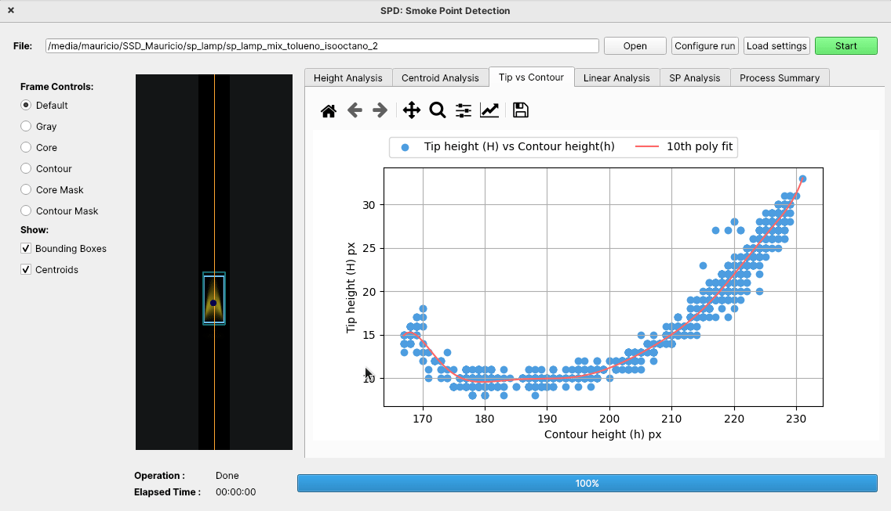

# Example use

<p align="center">
  
</p>


The SPD can be used in both forms (GUI/CLI) to perform analysis over a frame folder containing the resulting images capturated from a SP experiment on the ASTM-D1322 Standarized Lamp. The requierements of the frames images taken from the tests and the experimental setup are detailed on [EXPERIMENT.md](EXPERIMENT.md), it is recommended to read this carfully before using the program to achieve better results.

## Index

- [Example use](#example-use)
  - [Index](#index)
  - [GUI](#gui)
    - [1- Load the frames](#1--load-the-frames)
    - [2 - Preprocessing](#2---preprocessing)
    - [3 - Start the analysis](#3---start-the-analysis)
    - [4 - Results](#4---results)
  - [CLI](#cli)
    - [Example analysis](#example-analysis)
    - [Interoperability CLI-GUI](#interoperability-cli-gui)

## GUI

### 1- Load the frames


The frame images must follow an specific naming scheme to be properly load. They should be enumerated starting from 0, using a leading zero naming convention i.e. the first frame could be named `0000.tiff` and the second one `0001.tiff`. This is to follow the scheme used on `Basler` cameras and OpenCV frame loader functionality. 

### 2 - Preprocessing

After loading the frame folder, the next step is Preprocessing. This process combines cutting the frame to a more adequate size, selecting the threshold for the regions of interest, calibrating the pixel to milimiter conversion factor and changing some of the processing constant to be applied on the SP detection algorithm. 

- **Cutting**: In this step the frames can be cut to a more manageable size. The first frame (i.e. `0000.tiff`) is used to exemplify the process. The region of interest to be cutted can be adjusted with the mouse, clicking on the image moves the center line (blue line) and scrolling the mouse wheel adjusts the size of the area to be cutted (orange lines). Extra controls can be found to precisely adjust the cutting-area. An auto-cut function is also implemented, that can aid in the process. 


- **Thresholding**: Here, the selected values for the regions of core and contour can be selected. The associated threshold values for each region are input as a percentage value of the maximum pixel intensity (255 in this case). A preview of the effect of each threshold value can be viewed on the left side. Information about the area and height region derivated from the threshold values is present below the controls of each threshold. 


- **Camera Calibration:** This steps allow to convert the pixel values obtained from the frames, like the region heights, onto milimiters. For this a calibration image is requiered, consisting of a chessboard located inside the ASTM-D1322 lamp (as described in [EXPERIMENT.md]). The number and size of squares on the chessboard are input before clicking on the `Process` button. After thre calibration process is done, a grid of dots should appear on the image, located at the corners of the innermost grid of the chessboard (if the chessboard is 5x5, the resulting dots are on top of the inner 4x4 grid). A conversion factor is calculated and returned, this value can be adjusted or modified according to the needs of the experiment. If the value is already known the image calibration process can be avoided and the value can be input on the `Factor` field. 


- **Run settings:** In the left side of this section, the `General Settings` related to the subsequential analysis can be adjusted, like the `Derivative threhold` that controls the values that are considerated part of the linear-region and the `Centroid tolerance` which controls how much the analyzed frames can deviate from the reference centroid before being considerated invalid. 


On the right side of the section a `Run Summary` is displayed which contains all the values, constant and settings that will be used in the analysis, in this point also you can save the configurations onto a json file to be re-used in another run. 


To load this configuration file, from the main window, press `Load Settings` and select the json desired json file. 


- **Individual Save and Load operations**: As you may have noticed, each step of the preprocessing has controls to save and load settings from json files. This allows a more granular control and reusability of each step. To save a configuration just press the save button and assign a name to the json file.


And to load the configurations, you press the `Load` button and select the desired json file.


### 3 - Start the analysis

Pressing the `Start` button triggers the analysis. This occurs in two stages, in the first one, each frame is analyzed to get the height of each region and verify that the frame is actually valid (centroid condition). During this stage a `Height Analysis` plot shows the general view of heights obtained from the data and the `Centroid Analysis` shows the valid and invalid frames according to the tolerances. Each frame is displayed and can be controlled to show the default image, grayscale, the images resulted from applying the core and contour threshold and the associated regions masks, as well as the bounding boxes for the regions and centroid and reference for the frames. The second stage is automatically triggered when the first one ends and performs the polynomial, linear-region analysis and SP search. 


### 4 - Results

After both stages from analysis are done, three new plots appear in the main window. In `Tip vs Contour` tab the relationship between contour is represented by the fitted 10th order polynomial. In the `Linea Analyis` tab, the second derivative of the polynomial is showed and the found linear-region (according to the configured derivative threshold is showed). Finally, in the `SP Analysis` the 10th order polynomial is intersected with the linear-region fitted line. The first contour height value to be over a certain tolerance over the fitted line, is considerated the SP and showed on the plot. A summary of the analysis is condensed on the `Process Summary` tab. 




## CLI

The CLI version of the algorithm relies on arguments to configure the analysis. This arguments can be viewed by passing the following flag:

```[bash]
$ python SPD.py -h
```

That results in the following output:

```[bash]
usage: SPD.py [-h] [-cmd] [-i INPUT] [-config CONFIG] [-d] [-core THRESHOLDCORE] [-contour THRESHOLDCONTOUR] [-dt DERIVATIVETHRESHOLD]
              [-ct CENTROIDTOLERANCE] [-sv [SAVEVALUES]] [-mm MM] [-cut CUT [CUT ...]] [--Verbose]

Smoke Point Detection (SPD) is a python-based software that implements an algorithm that allows to perform smoke point characterization of
fuel blends tested on the ASTM-D1322 Standarized Lamps. The software uses images taken during the lamp tests and allows to automatically
detect the smoke point.

optional arguments:
  -h, --help            show this help message and exit
  -cmd                  Only terminal mode enabled. In GUI mode, none of the other arguments are used
  -i INPUT, --Input INPUT
                        Input video or image folder to process
  -config CONFIG        Loads configurations for threshold (core, contour and derivative), frame cutting information, centroid tolerance
                        and px2mm conversion from a json file.
  -d, --Display         Displays resulting plots
  -core THRESHOLDCORE, --ThresholdCore THRESHOLDCORE
                        Percentage of the max value to use as threshold for the core region. Default is 29%
  -contour THRESHOLDCONTOUR, --ThresholdContour THRESHOLDCONTOUR
                        Percentage of the max value to use as threshold for the contour region. Default is 14%
  -dt DERIVATIVETHRESHOLD, --DerivativeThreshold DERIVATIVETHRESHOLD
                        Lower bound for finding linear region. By default is 2e-05
  -ct CENTROIDTOLERANCE, --CentroidTolerance CENTROIDTOLERANCE
                        Centroid tolerance for discarting frames. By default is 10
  -sv [SAVEVALUES], --SaveValues [SAVEVALUES]
                        Save the obtained contour and tip height values and the resulting plots of analysis
  -mm MM                A conversion factor from px to mm can provided
  -cut CUT [CUT ...]    Cut the frames columnwise from center axis
  --Verbose             If passed enables information prints through terminal.

```


### Example analysis

To enable cli mode `-cmd` shall always be passed along with the configuration arguments. An example case to process a frame folder could be:

```[bash]
$ python SPD.py -cmd -i sp_experiment_folder/  -core 3.0 -contour 0.8 -dt 0.035 -ct 10 -cut 910 1010
```

This will perform the analysis on the `sp_experiment_folder`, using a core threshold of 3\%, contour threshold of 0.8\%, derivative threshold of 0.035, centroid tolerance of 10 pixels and will cut the input frames with an area of interest from x_coordinate 910 to 1010. 


The resulting SP will be informed by terminal output


If you want to see the same plots than in the GUI, you can add the `-d` flag:

```[bash]
$ python SPD.py -cmd -i sp_experiment_folder/  -core 3.0 -contour 0.8 -dt 0.035 -ct 10 -cut 910 1010 -d
```

This will result in all the plots displaying at the end of the analysis:


**You can also automatically save the resulting plots and the values for contour and tip height in a folder by passing the `-sv` argument. If no value is provided for this argument a folder with the current date-time will be generated for the outputs. If you provided a value like `-sv output-folder` this will be used.**


### Interoperability CLI-GUI

To allow an easier and faster configuration, you can use configuration files obtained from the GUI to setup the analysis. Rememeber section [2 -Preprocessing](#2---preprocessing) where we save a json config file named `process.json`. Using the `-config` argument with the file name, we can setup the analysis easily. 

```[bash]
$ python SPD.py -cmd -i sp_experiment_folder/ -config process.json
```


