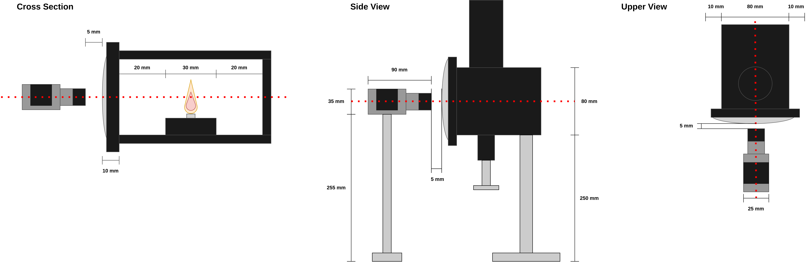

# Experimental Setup

  

In this section the way of taking images from the SP test realized on the ASTM-D1322 Standarized Lamp are described. 

## Index

- [Experimental Setup](#experimental-setup)
  - [Index](#index)
  - [Setup: Camera and Lamp positioning](#setup-camera-and-lamp-positioning)
  - [Camera Calibration:](#camera-calibration)
    - [How the calibration works?](#how-the-calibration-works)

## Setup: Camera and Lamp positioning

The camera must be positioned according to the specifications showed in the following figure: 

The camera used corresponds to a `Basler acA 1920-50gc`. The images were capturated using the `Pylon Viewer` software with the following settings:

| Parameter | Value | 
|-----------|-------|
| Width | 1920 px |
| Height | 1200 px | 
| Exposure Time | 100 $\mu$s |
| Exposure Auto | Off | 
| Gain (Raw) | 0 | 
| Gain Auto | Off | 
| White Balance | Off |
| Frame rate | 20 fps | 
| Output format | Tiff |
| Configuration Set Selector | Color RAW | 

## Camera Calibration: 

To calibrate the camera and get the pixel to milimeters conversion factor. A cheesboard pattern like the one showed in the figure is positioned inside the combustion chamber of the lamp. A frame image is taken in this setup (using the camera positioning described in the previous section), the later is then used by the program to derived the conversion factor, this is described in the section [Example use: 2- Preprocessing](EXAMPLE.md). 

An example image use for calibration:

### How the calibration works?

To get the convertion factor, the algorithm use the OpenCV `findChessboardCornersSB` function to find the corners inside the chessboard.

The corners are translated to 2D-points, for each square the four sides are calculated from the points ($a_{k}$) and averaged ($s_{i}$):

$$ s_{i} = \frac{1}{4}\sum_{k=1}^{4} a_{k}  $$ 

In the example chessboard we have a 5x5 grid, the algorithm uses the innermost 4x4 squares for the process, resulting in 16 side values. 
All resulting values for each square are averaged (S): 

$$ S =  \frac{1}{16} \sum_{i=1}^{16} s_{i} $$

The calibration algorithm takes this information and the actual size of each square ($S_{r}$), in the example each square is 10 mm x 10 mm. Then the conversion factor is derived as follows: 

$$ factor = \frac{S_{r}}{S} $$

Then the conversion from pixel to milimeter of the values in the algorithm results in a simple multiplication:

$$ value_{mm} = value_{px} \cdot factor $$