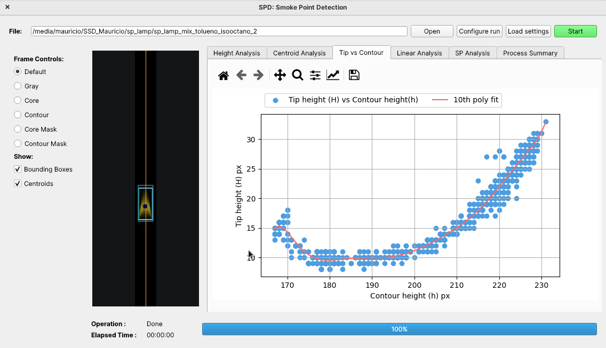
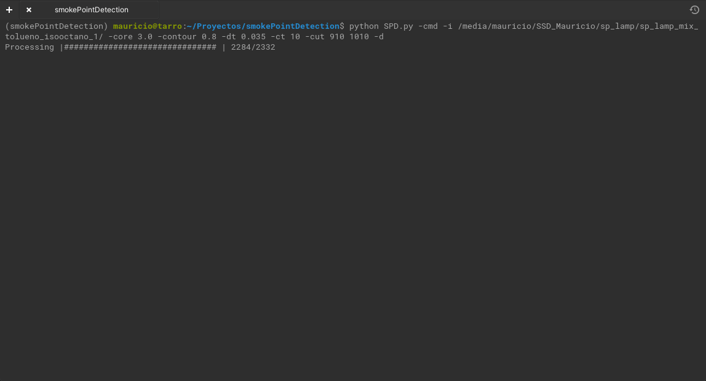

# Smoke Point Detection

**Smoke Point Detection (SPD)** is a python-based software that implements an algorithm that allows to perform smoke point characterization of fuel blends tested on the ASTM-D1322 Standarized Lamps. The software uses images taken during the lamp tests and allows to automatically detect the smoke point. 

<p align="center">
  
</p>


**The algorithm is an python implementation of the work described in the work of :** 

```
Corral-Gomez, L., Rodriguez-Rosa, D., Juarez-Perez, S., Martín-Parra, A., Gomez, G. R., & Moya-Fernandez, F. (2020). A novel device for automated determination of the smoke point with non-invasive adaptation of ASTM D1322 normalized lamps. Measurement Science and Technology, 31(11), 115004.
```


## Index

- [Smoke Point Detection](#smoke-point-detection)
  - [Index](#index)
  - [Installation](#installation)
  - [Example use](#example-use)
  - [LICENSE](#license)


## Installation

Instructions to install either from packages (Windows) or sources (Linux, Windows, OSX) and the requirements are provided on [INSTALL.md](INSTALL.md)


## Example use

Complete examples for both the GUI and CLI version can be found on [EXAMPLE.md](EXAMPLE.md)





## LICENSE

**The SPD software is under the [LGPLv3](https://www.gnu.org/licenses/lgpl-3.0.en.html) license.**

All dependencies included in the compiled version of the software distribuited on the release page of the repository include a copy of their license according to their own terms. The licenses of the dependencies can be checked on [DEPENDENCY_LICENSES](/DEPENDENCY_LICENSES/).