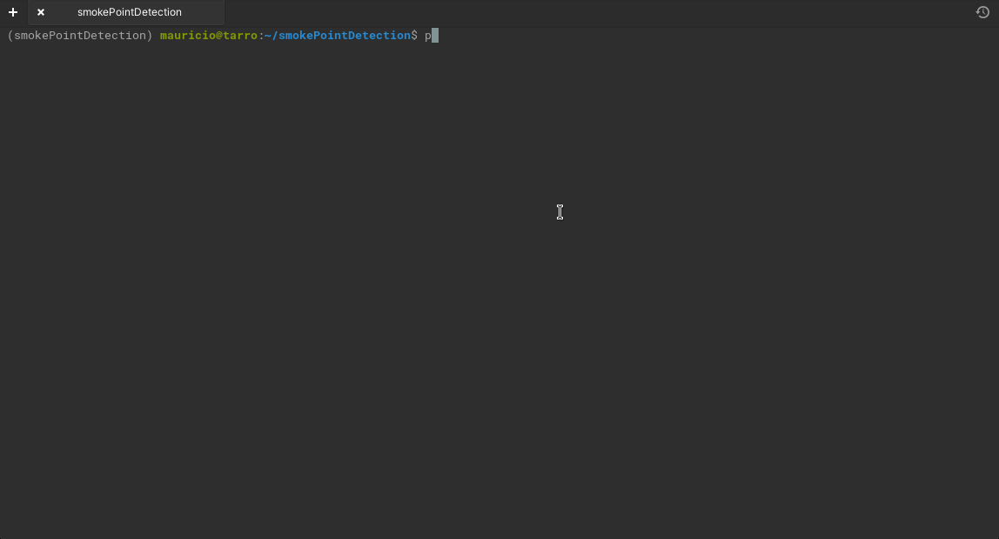

# Smoke Point Detection

**Smoke Point Detection (SPD)** is a python-based software that implements an algorithm that allows to perform smoke point characterization of fuel blends tested on the ASTM-D1322 Standarized Lamps. The software uses images taken during the lamp tests and allows to automatically detect the smoke point. 

**The algorithm is an python implementation of the work described in the work of :** 

```
Corral-Gomez, L., Rodriguez-Rosa, D., Juarez-Perez, S., Martín-Parra, A., Gomez, G. R., & Moya-Fernandez, F. (2020). A novel device for automated determination of the smoke point with non-invasive adaptation of ASTM D1322 normalized lamps. Measurement Science and Technology, 31(11), 115004.
```


## Index

- [Smoke Point Detection](#smoke-point-detection)
  - [Index](#index)
  - [Installation](#installation)
    - [From sources (Linux, OSX, Windows)](#from-sources-linux-osx-windows)
      - [Requirements](#requirements)
        - [pipenv installation](#pipenv-installation)
        - [pip installation](#pip-installation)
      - [Post installation:](#post-installation)
  - [Use example](#use-example)
  - [How it works?](#how-it-works)
  - [Constants decription](#constants-decription)


## Installation

### From sources (Linux, OSX, Windows)

To install from sources you only need a copy of this repository!

#### Requirements

The software was developed using `Python 3.8`, and all of the following dependencies are listed with this version in mind. However, it is possible that the software is compatible with newer versions of the interpreter and dependencies. This includes the Pipfiles and requirements.txt files.


| **Dependency** | **Version** | **Description** | **License**|
|----------------|-------------|-----------------|------------|
| progress | 1.6 | Used to provide a progress bar in the CLI mode | [ISC](https://github.com/verigak/progress/blob/master/LICENSE)
| matplotlib | 3.7.1 | Handles all the requiered plots | [PSF based](https://github.com/matplotlib/matplotlib/blob/main/LICENSE/LICENSE)
| PySide2 | 5.15.2.1 | Used to build the GUI | [LGPLv3](https://www.gnu.org/licenses/lgpl-3.0.en.html)|
| opencv-python-headless | 4.7.0.72 | Operations with images. The headless version was used because there were some conflicts between pyqt and opencv when using the normal version.| [MIT](https://github.com/opencv/opencv-python/blob/4.x/LICENSE.txt) [External](https://github.com/opencv/opencv-python/blob/4.x/LICENSE-3RD-PARTY.txt)|
| contourpy | 1.0.7 | Used by Matplotlib | [BSD](https://github.com/contourpy/contourpy/blob/main/LICENSE) | 
| cycler | 0.11.0 | Used by Matplotlib | [BSD](https://github.com/matplotlib/cycler/blob/main/LICENSE) | 
| fonttools | 4.39.2 | Used by Matplotlib | [MIT](https://github.com/fonttools/fonttools/blob/main/LICENSE)  [External **\***](https://github.com/fonttools/fonttools/blob/main/LICENSE.external) | 
| importlib-resources | 5.12.0 | Used by Matplotlib | [Apache 2](https://github.com/python/importlib_resources/blob/main/LICENSE) |
| kiwisolver | 1.4.4 | Used by Matplotlib | [New BSD](https://github.com/nucleic/kiwi/blob/main/LICENSE) |
| numpy | 1.24.2 | Used for frame and matrix-like numerical operations. Also used by Matplotlib | [BSD](https://github.com/numpy/numpy/blob/main/LICENSE.txt) [External](https://github.com/numpy/numpy/blob/main/LICENSES_bundled.txt) | 
| packaging | 23.0 | Used by Matplotlib | [Apache](https://github.com/pypa/packaging/blob/main/LICENSE.APACHE) [BSD](https://github.com/pypa/packaging/blob/main/LICENSE.BSD) |
| pillow | 9.4.0 | Used by Matplotlib | [HPND](https://github.com/python-pillow/Pillow/blob/main/LICENSE) | 
| pyparsing | 3.0.9 | Used by Matplotlib | [MIT](https://github.com/pyparsing/pyparsing/blob/master/LICENSE) |
| python-dateutil | 2.8.2 | Used by Matplotlib | [Apache 2](https://github.com/dateutil/dateutil/blob/master/LICENSE) |
| shiboken2 | 5.15.2.1 | Used by PySide2 | [LGPLv3](https://www.gnu.org/licenses/lgpl-3.0.en.html) |
| six | 1.16.0 | Used by Matplotlib | [MIT](https://github.com/benjaminp/six/blob/master/LICENSE) |
| zipp | 3.15.0 | Used by Matplotlib | [MIT](https://github.com/jaraco/zipp/blob/main/LICENSE) |


**\* External refers to third-party software used by the dependency itself.**

Although not requiered to run the software, this dependencies were used to compiled the package (`exe`) for Windows:

| **Dependency** | **Version** | **Description** |
|----------------|-------------|-----------------|
| pyinstaller | 5.9.0 | Package Windows application |
| pip-licenses | 4.1.0 | Try to understand what license can I use for this piece of software|


##### pipenv installation

To install the dependencies use the `Pipfile` and `Pipfile.lock` provided with the repository. Using the following command from the root of the project to install them:

```[bash]
$ pipenv install 
```

If you also want to install the `dev` dependencies (i.e to package for Windows), use the following command:

```
$ pipenv install -dev
```

After installation you need to activate the virtual environment running:

```[bash]
$ pipenv shell
```

##### pip installation

To install the dependencies use the `requirements.txt` provided with the repository. Using the following command from the roof of the project to install them: 

```[bash]
$ pip install -r requirements.txt
```

#### Post installation:

After installing the dependencies, you should be able to run the code. You can try to run it using the following commands from the root of the project.

**CLI mode:**

```[bash]
python SPD.py -cmd
```


**GUI mode**:
```[bash]
python SPD.py
```




## Use example

## How it works?

## Constants decription